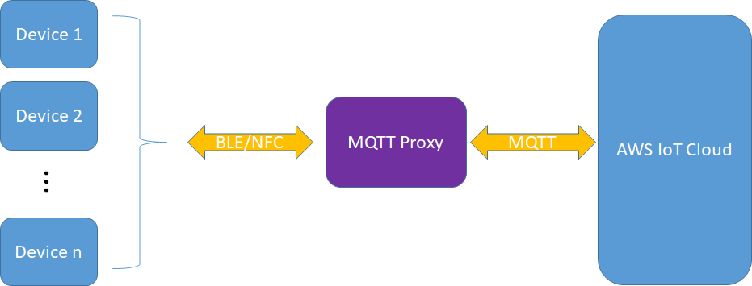
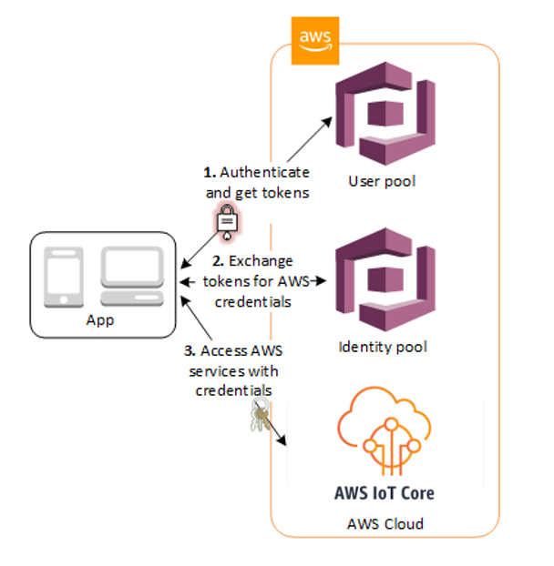
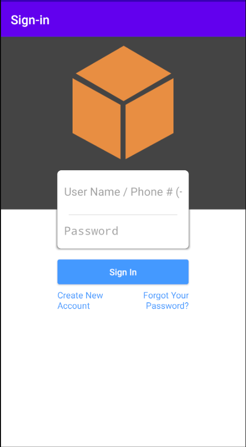
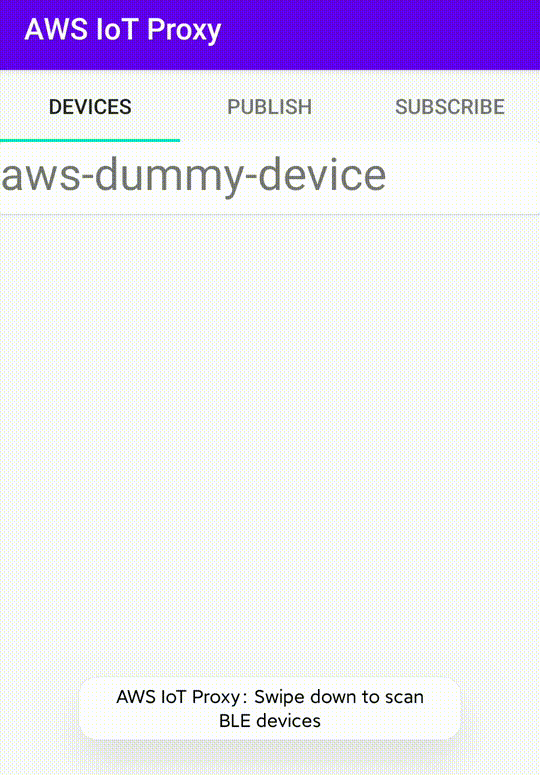
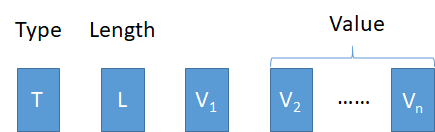

# AWS IoT Proxy Mobile App for BLE Devices

In order for Bluetooth Low Energy (BLE) devices to connect to AWS IoT, AWS has provided the [FreeRTOS BLE Library](https://docs.aws.amazon.com/freertos/latest/userguide/freertos-ble-library.html) for BLE devices to use MQTT, and [Mobile SDKs for Android and iOS](https://docs.aws.amazon.com/freertos/latest/userguide/freertos-ble-mobile.html) for mobile devices to act as connecting agents to AWS IoT.  

In order to use those technologies, developers need to integrate the FreeRTOS BLE Library into the BLE device.  The integration is difficult for some BLE devices especially for brown-field devices that are already running in the field.  For new BLE devices, some developers choose not do add additional components into the firmware.

To address the need of such applications, this repository provides reference implementation of an Android app that can interact with BLE devices without requiring the device to run the FreeRTOS BLE Library.  As long as the device runs a GATT server, this app can connect to it, convert the information sent by the BLE device into MQTT messages and publish them to AWS IoT.  This app can be customized to subscribe to MQTT topics, convert messages into proprietary format then send them over to the BLE device.  The diagram below illustrate this architecture.



## Prerequisites

This proxy using AWS Cognito as credential provider.  Refer to the “Set up AWS IoT and Amazon Cognito” section in [this document](https://docs.aws.amazon.com/freertos/latest/userguide/ble-demo.html) for how to set it up to work with this application.



## Quick Start
1. git clone this project.
2. Update **Thing ID**, **Broker Endpoint**, **IoT Policy name**, **AWS Region** in com/amazonaws/awsiotproxy/ProxyConfig.java.  Refer to this document (https://docs.aws.amazon.com/freertos/latest/userguide/ble-demo.html#ble-sdk-app) and follow the instructions under “**To configure the Android SDK demo application**” to create the IoT Policy.  
3. Update **Cognito Identity PoolId/Region**, **Cognito User PoolId/Region/AppClientId/AppClientSecret** in raw/awsconfiguration.json.  Refer to this document (https://docs.aws.amazon.com/freertos/latest/userguide/ble-demo.html) and follow the instructions under “**Set up AWS IoT and Amazon Cognito**” to set up and get the values for those configurations.
4. Build the mobile app, install it on an Android device, launch it.
5. A sign in/sign up page will show up. User can sign in with Cognito user name/password, or choose to create a new account via sign up:
   
6. On the **DEVICES** tab, a dummy device will be created base on the info in com/amazonaws/awsiotproxy/ProxyConfig.java. Click it to create connection with AWS IoT core.
7. After connected to AWS IoT core, dummy device will publish to topic **"proxy/test"** with a json format payload every 5 secs.
8. After connected to AWS IoT core, use **PUBLISH** and **SUBSCRIBE** tabs to publish/subscribe/unsubscribe to/from specific topic.
9. User can check MQTT messages on AWS IoT console. For more details, refer to this [document](https://docs.aws.amazon.com/iot/latest/developerguide/view-mqtt-messages.html);

## Use with [ESP32 gatt_server demo](https://github.com/espressif/esp-idf/tree/master/examples/bluetooth/bluedroid/ble/gatt_server)
The Android application built in the previous step can work with an ESP32 device running with its gatt_server demo after you apply a patch contained in this project.

1. Install the ESP IDF (https://github.com/espressif/esp-idf).
2. Apply patch from this project.  Assuming you have installed this project under <install_dir> and ESP IDF has been installed under <esp_idf_dir>:

```bash
cp <intall_dir>/esp32_patch/0001-aws-iot-proxy-adding-dummy-message-for-aws-iot-proxy.patch <esp_idf_dir>/examples/bluetooth/bluedroid/ble/gatt_server
cd <esp_idf_dir>/examples/bluetooth/bluedroid/ble/gatt_server
git apply 0001-aws-iot-proxy-adding-dummy-message-for-aws-iot-proxy.patch
```

3. Build and flash ESP32:

```bash
idf.py build
idf.py -p /dev/ttyUSB0 flash
```

4. Boot up the ESP32 device.  Go to the mobile app, swipe down to scan new devices.  The ESP32 should appear on the screen.
5. Click device in devices list to connect.
6. ESP32 will send dummy data to the mobile app, then the app will convert the data into JSON payload and publish to AWS IoT Core.



## Customize the mobile app for use with proprietary protocol over GATT
In this reference implementation, a CustomizedThing is abstracted as a java class to provide the following functionalities:

* Connect to IoT: Connect to AWS IoT cloud as a Cognito user.
* Publish to IoT: Publish message to specific topic.
* Subscribe to IoT: Subscribe to specific topic.
* Unsubscribe to IoT: Unsubscribe to specific topic.
* Publish to Thing: When received message from subscribed topic, send it back to local devices.
* Send ACK to Thing: Send ACK to device when publish/subscribe/unsubscribe successfully.

To adapt it with private local protocol:
1. Extend from `class CustomizedThing`.
2. Create coder/decoder similar to `class MyTLV`, which supports decode messages from device to connect/publish/subscribe/unsubscribe behaviors and encode ACK/publish messages from Cloud/App to device. 

Since the data type of GATT characteristics operation is bytes array, user need to define several methods takes bytes array and `CustomizedMqttEnvelope`  as parameters. Take `class MyTLV` as an example, which defines a simple TLV(Type-Length-Value) protocol:



In this example protocol, we defined 7 types as blow:

```java
public enum TLVType {
        INVALID,
        PUBACK,
        SUBACK,
        UNSUBACK,
        PUB,
        SUB,
        UNSUB,
}
```

To make it adapt with Proxy, we defines constructor:

* `MyTLV(CustomizedMqttEnvelope envelope)`: Create a `MyTLV` object with `CustomizedMqttEnvelope`. It will call `MyTLV.encode()` method inside to generate encoded bytes array write to device characteristics base on input envelope.
* `MyTLV(@NonNull byte[] encodedBytesStream)`: Create a `MyTLV`  object with encoded bytes array read from device characteristics . It will call `MyTLV.decode()` method to get type, length, and values from encoded bytes. After that, user can call `CustomizedMqttEnvelope.toCustomizedMqttEnvelope()`  to get a `CustomizedMqttEnvelope` object.

## Security

See [CONTRIBUTING](CONTRIBUTING.md#security-issue-notifications) for more information.

## License

This library is licensed under the MIT-0 License. See the [LICENSE](LICENSE) file.
